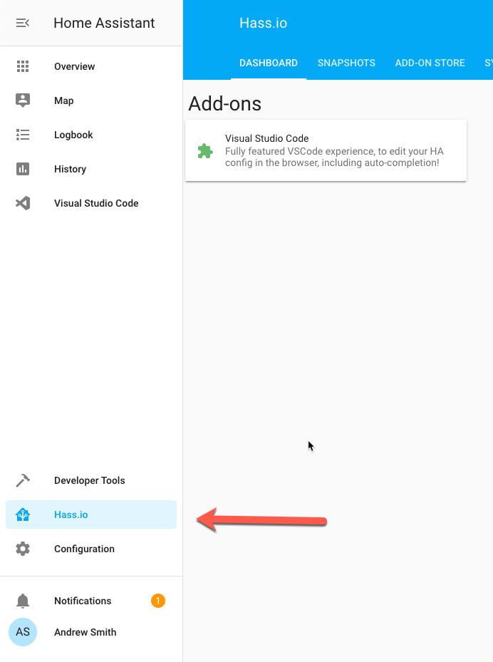

# Hub

## Parts List

- Intel NUC
- [Z-Wave USB stick](https://www.amazon.com/gp/product/B00X0AWA6E/ref=ppx_yo_dt_b_search_asin_title?ie=UTF8&psc=1)
- Bluetooth dongle

## Setup

I installed [hass.io](https://www.home-assistant.io/hassio/) (built on top of [Home Assistant](https://www.home-assistant.io/)) on the NUC. Unfortunately, the [download from hassio](https://www.home-assistant.io/hassio/installation/) is **not an installer**. Below outlines the steps I took to install it.

### Install Ubuntu

I had issues installing Ubuntu Server, but was able to successfully install [Ubuntu Desktop 19.10](https://ubuntu.com/download/desktop). I used [balenaEtcher](https://www.balena.io/etcher/) to flash the USB drive.

### System Setup

> Setup OpenSSH for remote shell access

```shell
sudo apt-get install openssh-server
sudo systemctl enable ssh
sudo systemctl start ssh
```

> You can now ssh into ubuntu instance via `ssh username@ip`

### Install Docker

> Install Docker

```shell
sudo apt-get update
sudo apt-get remove docker docker-engine docker.io
sudo apt install docker.io
sudo systemctl start docker
sudo systemctl enable docker

docker -v
```

### Enable Remotely Connecting to Docker

Summarized from this [guide](https://nickjanetakis.com/blog/docker-tip-73-connecting-to-a-remote-docker-daemon), below will enable running docker commands from your local docker on the hub.

> Configure hub's docker daemon to allow remote connections

```shell
sudo mkdir -p /etc/systemd/system/docker.service.d
echo "[Service]
ExecStart=
ExecStart=/usr/bin/dockerd -H unix:// -H tcp://0.0.0.0:2375" > /etc/systemd/system/docker.service.d/options.conf

sudo systemctl daemon-reload
sudo systemctl restart docker
```

> Connect to hub's docker from local docker

```shell
export DOCKER_HOST=tcp://hubip:2375
docker info
docker ps

# Back to local docker
export DOCKER_HOST=
docker info
docker ps
```

### Install Home Assistant/hassio

```shell
sudo apt-get install -y jq avahi-daemon avahi-discover avahi-utils libnss-mdns mdns-scan
curl -sL "https://raw.githubusercontent.com/home-assistant/hassio-installer/master/hassio_install.sh" | sudo bash -s
```

### Setup Home Assistant

> Navigate to `http://ip:8123` where `ip` is the IP address of the ubuntu instance. Create your account.

## Helpful Hass.io Addons

1. [Visual Studio Code in Home Assistant](https://github.com/hassio-addons/addon-vscode) to make editing the configuration files on the device enjoyable (also offer IntelliSense for your defined devices)
2. [Portainer](https://github.com/hassio-addons/addon-portainer) to easily manage containers that are NOT installed through hassio’s community add-ons
3. [MQTT Server and Web Client](https://community.home-assistant.io/t/community-hass-io-add-on-mqtt-server-web-client/70376) for services requiring MQTT, a lightweight message queue
4. [Samba Share](https://www.home-assistant.io/addons/samba/) to more easily upload voice assistants
5. [Snips.ai](https://www.home-assistant.io/addons/snips/) for voice AI completely on the device (not Alexa, cloud, or eavesdropping)

> These addons are found in the Hass.io link in the main menu.


